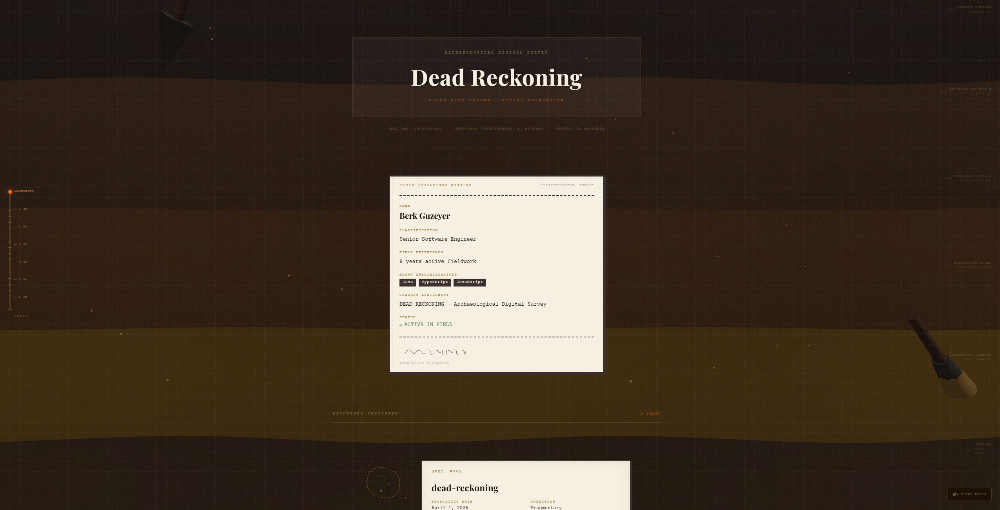

# Dead Reckoning

> Your GitHub profile as an active archaeological excavation.

---

## What it does

Pulls your pinned GitHub repositories and presents them as catalogued field specimens from an ongoing dig. Each repo gets an artifact shape, a material composition derived from its tech stack, a condition rating, and a two-sentence description written in the voice of a deeply serious field researcher.

There is also an open survey tool at the bottom of the page — paste any GitHub username and it generates the same report for their profile on the spot.

---

## Features

- Live GitHub data via REST and GraphQL APIs
- Per-repo catalog entries generated from README content
- Claude API integration for AI-written descriptions (falls back to local generation without a key)
- 3D artifact animations with GSAP
- Ambient audio, entry animation sequence, and a depth meter
- Guest excavation tool for any public GitHub profile

---

## Technical highlights

The site reads pinned repos via the GitHub GraphQL API, fetches each README, and runs it through a description generator. If an Anthropic API key is present it calls Claude; if not, a local pattern-matching engine extracts the stack and purpose from the README and writes something specific to that project. Material composition labels are derived from framework detection across README content rather than just the primary language.

---

## Stack

React, TypeScript, Vite, GSAP, GitHub REST API, GitHub GraphQL API, Claude API
